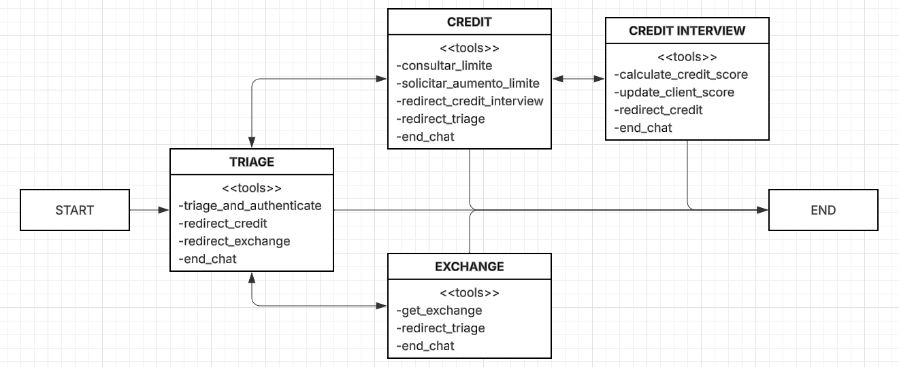
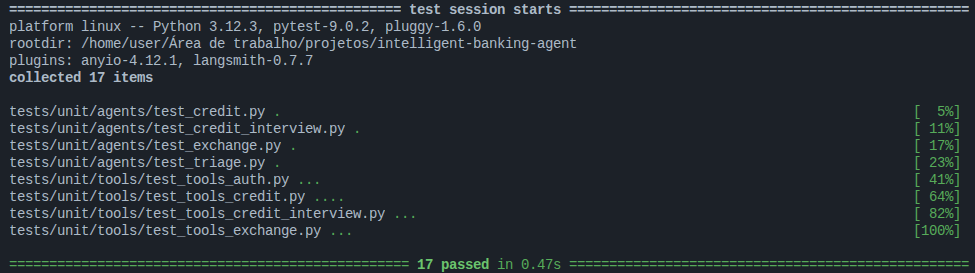

# Intelligent Banking Agent

## Visão Geral do Projeto
O Intelligent Banking Agent é um ecossistema de atendimento ao cliente para um banco digital fictício, baseado em agentes de IA especializados. O objetivo é simular um atendimento bancário inteligente, modular e seguro, com fluxos claros e automação de decisões, utilizando LLMs e orquestração multi-agente.

## Estrutura do Código

```
├── app.py                 # Interação com Streamlit
├── main.py                # Interação com CLI
├── src/
│   ├── agents/            # Definição dos agentes e seus prompts
│   │   ├── triage.py
│   │   ├── credit.py
│   │   ├── credit_interview.py
│   │   └── exchange.py
│   ├── tools/             # Ferramentas (tools) de cada agente
│   │   ├── auth.py
│   │   ├── credit.py
│   │   ├── credit_interview.py
│   │   ├── exchange.py
│   │   └── common.py
│   ├── utils/             # Utilitários compartilhados (ex: db_utils.py)
│   ├── config.py          # Configuração do LLM e paths
│   ├── graph.py           # Orquestração do grafo multi-agente
│   └── state.py           # Definição do estado compartilhado
├── data/                  # Arquivos CSV de clientes, limites, solicitações
├── tests/                 # Testes automatizados: unit/ (mocks) e e2e/ (casos manuais)
├── docs/                  # Documentação e fluxogramas
└── requirements.txt       # Dependências do projeto
```

## Arquitetura do Sistema
O sistema é composto por múltiplos agentes, cada um com responsabilidades bem definidas:

- **TRIAGE**: Responsável pela autenticação inicial e roteamento do cliente para o serviço adequado.
- **CREDIT**: Gerencia consultas e solicitações de aumento de limite de crédito.
- **CREDIT INTERVIEW**: Realiza entrevistas financeiras para recalcular o score do cliente.
- **EXCHANGE**: Fornece cotações de moedas estrangeiras em tempo real.

O fluxo entre agentes é orquestrado por um grafo de estados (LangGraph), que garante transições automáticas e uso obrigatório de ferramentas de transferência. O histórico de mensagens é preservado entre agentes, mantendo o contexto da conversa.

### Fluxograma da Arquitetura


> O fluxograma acima ilustra o fluxo entre os agentes, as ferramentas disponíveis em cada um e as possíveis transições.

## Funcionalidades Implementadas
- Autenticação de clientes via CPF e data de nascimento.
- Consulta e solicitação de aumento de limite de crédito.
- Entrevista financeira automatizada para recalcular score.
- Consulta de cotações de moedas (USD, EUR, JPY) em tempo real.
- Encaminhamento automático entre agentes conforme o pedido do cliente.
- Encerramento cordial do atendimento.

## Manipulação de Dados e Estado

O sistema utiliza um grafo de estados (LangGraph) para orquestrar o fluxo entre agentes. Toda a interação do usuário, respostas dos agentes e resultados de ferramentas são armazenados em um objeto de estado compartilhado (`AgentState`). Esse estado inclui:

- Histórico completo de mensagens (perguntas, respostas, tool calls e resultados), preservando o contexto da conversa mesmo após transferências entre agentes.
- Dados do cliente autenticado (nome, CPF, limite, score), atualizados dinamicamente conforme as ferramentas são usadas.
- Flags de controle, como agente atual (`current_agent`), tentativas de autenticação e sinalização de encerramento (`should_end`).

As transições entre agentes são feitas exclusivamente por ferramentas de transferência (ex: `redirect_triage`), garantindo rastreabilidade e controle do fluxo.

Para persistência, dados sensíveis (clientes, limites, solicitações) são lidos e gravados em arquivos CSV, permitindo fácil inspeção, testes e auditoria. Cada operação de consulta ou atualização de dados é feita por ferramentas específicas, que manipulam os arquivos de forma segura e transparente.

Esse modelo garante que:
- O contexto conversacional nunca é perdido, mesmo em fluxos complexos.
- Todas as decisões e atualizações são rastreáveis e auditáveis.
- O sistema é robusto contra inconsistências de estado e fácil de depurar.

## Stack

- **Python**: Linguagem escolhida por sua ampla adoção em IA, facilidade de integração com bibliotecas de NLP, manipulação de dados e orquestração de fluxos conversacionais.
- **LangGraph**: Escolhido para orquestração multi-agente devido à flexibilidade, suporte a grafos de estado e integração nativa com LLMs, permitindo transições dinâmicas e controle preciso do fluxo.
- **LangChain + OpenAI**: Permite fácil binding de ferramentas, integração com modelos GPT, e controle do fluxo conversacional, além de facilitar logging e debugging.
- **LangSmith**: Utilizado para rastreamento, análise e depuração de fluxos de conversação, facilitando a identificação de falhas, análise de decisões do LLM e melhoria contínua dos prompts.
 - **Pytest**: Estrutura de testes usada para executar a suíte de testes unitários e e2e, facilitar TDD e integração contínua.
- **Persistência em CSV**: Dados de clientes, limites e solicitações são armazenados em arquivos CSV para simplicidade, transparência e fácil inspeção manual durante o desenvolvimento e testes.
- **API de Cotação Frankfurter**: Escolhida por ser gratuita, confiável e não exigir autenticação, permitindo obter cotações de moedas em tempo real sem custos ou limitações severas de uso.
- **Separação por módulos**: Cada agente e conjunto de ferramentas reside em seu próprio módulo, facilitando manutenção, extensibilidade e testes isolados.

### Escolha do Modelo LLM

Optou-se pelo uso do modelo **gpt-5-mini** ao invés de modelos menores devido à necessidade de melhor compreensão e controle das transições entre agentes no fluxo multi-agente. Foram realizados testes com modelos menores, como o **gpt-4o-mini** e o **gpt-4.1-nano**, porém identificou-se um gargalo significativo no "entendimento" dessas transições, resultando em respostas inconsistentes e falhas no uso correto das ferramentas de transferência entre agentes. O **gpt-5-mini** demonstrou desempenho superior nesse aspecto, garantindo maior robustez e aderência ao fluxo orquestrado, mesmo em cenários complexos de troca de contexto entre agentes.

## Desafios Enfrentados e Soluções
- **Obediência do LLM ao fluxo**: O maior desafio foi garantir que o LLM usasse sempre as ferramentas de transferência, sem improvisar respostas fora do escopo. Isso foi resolvido com prompts robustos, exemplos positivos/negativos e reforço de regras obrigatórias.
- **Persistência de contexto**: Manter o histórico de mensagens entre agentes sem poluir o contexto foi solucionado mantendo o state["messages"] integral, sem limpeza, e orientando os agentes a ignorar mensagens irrelevantes.
- **Separação de responsabilidades**: Cada agente foi projetado com escopo restrito e ferramentas específicas, evitando sobreposição de funções.
- **Testes de fluxo**: Foram realizados testes manuais e ajustes iterativos nos prompts e no grafo para garantir transições suaves e automáticas.

## Tutorial de Execução
1. Clone o repositório e instale as dependências:
	```bash
	git clone <repo-url>
	cd intelligent-banking-agent
	python3 -m venv .venv
	source .venv/bin/activate
	pip install -r requirements.txt
	```
2. Configure as variáveis de ambiente em `.env` (veja `.env.exemple`).
3. Execute o sistema:

- Para interação via terminal/CLI (modo texto):
```bash
python3 main.py
```

- Para interface web (frontend) via Streamlit:
```bash
streamlit run app.py
```

4. Siga as instruções na interface escolhida para interagir com o assistente.

## Testes
O diretório `tests/` contém a suíte criada para validar o comportamento das ferramentas e agentes sem alterar a base de dados real. A estrutura usada é:

- `tests/unit/`: testes automatizados e isolados (com *mocks*).
- `tests/e2e/`: casos de teste de ponta a ponta e roteiros manuais (`case.txt`).

### Objetivo dos testes
- **Unit (Tools):** Executar cada *tool* de forma isolada, simulando entradas e interceptando acessos a CSV/API com `unittest.mock` para garantir correções e regras de negócio (validações, cálculos, formatos).
- **Unit (Agents):** Validar a configuração estática dos agentes — se as ferramentas corretas estão registradas e se os *System Prompts* seguem as regras definidas (estatísticas/estruturais), evitando regressões de configuração.
- **E2E (manual):** Roteiros de teste humano para validar fluxos completos na interface (Streamlit/CLI) seguindo `tests/e2e/case.txt`.

### Como os testes isolam o acesso aos dados
Foi utilizado `@patch` para interceptar funções da camada de acesso (`src.utils.db_utils`), por exemplo `get_client_by_cpf` e `update_client_field`. Assim simulamos retornos esperados sem ler/gravar os arquivos em `data/` durante os testes.

### Convenção para arquivos de teste
Para evitar colisões de nomes entre testes de diferentes camadas, adote a convenção de prefixar os módulos de teste com o escopo. Exemplos:

- `tests/unit/tools/test_tools_<nome>.py`
- `tests/unit/agents/test_agents_<nome>.py`

Isso previne conflitos de importação quando existirem testes com o mesmo nome lógico em pastas diferentes.

### Como rodar os testes
1. Ative sua venv:
```bash
source .venv/bin/activate
```
2. (Opcional) Instale/atualize `pytest`:
```bash
pip install pytest
```
3. Execute os testes unitários:
```bash
PYTHONPATH=. python3 -m pytest tests/unit/
```

Os testes unitários usam mocks; nada no banco de dados real é modificado durante a execução.

### Resultados dos testes



> Resultado dos testes unitários com pytest presentes em `tests/`.

https://github.com/user-attachments/assets/cb08771f-44a5-482e-9e73-8f44643dad6e

> Resultado do case e2e presente em `tests/`.
> 
> Obs: Tentei intercalar entre agentes no inicio para poder mostrar as funcionalidades de redirecionamento.


